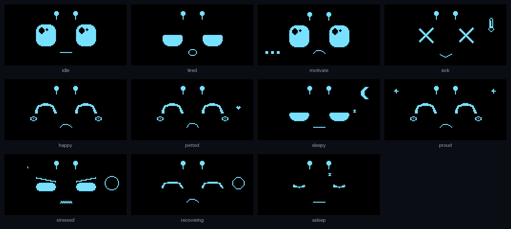
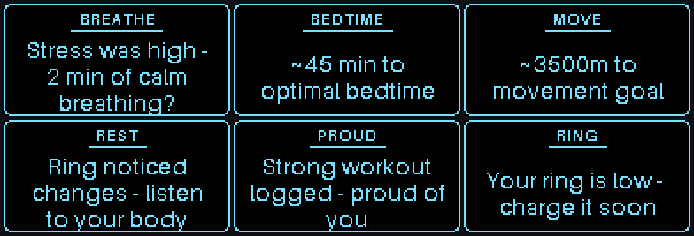
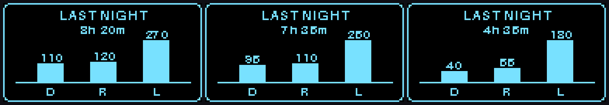
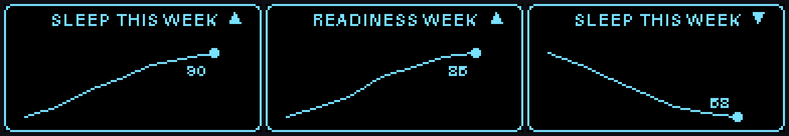

# Ouri

Your personal Oura wellness desk buddy. A small robot face that reflects your sleep, readiness, activity, and stress — with gentle reminders, not nagging.



Ouri connects to the [Oura API](https://cloud.ouraring.com/v2/docs) and turns your daily wellness into an expressive 128×64 OLED character: it looks tired after a rough night, nudges you to move when you've been sedentary, celebrates a strong workout, and winds down at bedtime. Built to run on a Raspberry Pi + OLED, but it ships with a Pygame **emulator** so you can develop and demo it with zero hardware.

> **Disclaimer:** Ouri is a wellness companion, not medical advice. Illness signals use temperature deviation and rest mode as soft proxies only.

## How it works

```
Oura API ──► WellnessSnapshot ──► Rules engine ──► Persona FSM ──► Display
 (or fixtures)   (normalized        (data → mood     (mood + pet      (face / card
                  daily data)        + reminder)      + notifications)  on OLED)
                                          ▲                ▲
                                       Scheduler ──────────┘
                                   (daily arc: quiet hours,
                                    morning briefing, nudges)
```

- **Data layer** (`api/`) — pulls daily summaries from the Oura API (or local JSON fixtures), normalizes them into a single `WellnessSnapshot`, and caches days locally for trends.
- **Rules engine** (`engine/`) — pure, testable functions that map a snapshot to a `RobotState` (tired, sick, proud, stressed…) plus a wellness reminder, using tunable thresholds in `config/`.
- **Persona** (`persona/`) — a finite-state machine that drives animation, handles petting, queues notifications, and runs the **scheduler** that gives Ouri a daily rhythm.
- **Display & input** (`display/`, `input/`) — a hardware-agnostic interface with two backends: a Pygame OLED **emulator** for your computer and an SSD1306 driver for the Pi. The same app code runs on both.

The whole thing is decoupled behind small protocols, so swapping fixtures for live data, or the emulator for real hardware, is a config change — not a rewrite. Covered by a [pytest](tests/) suite.

## Quick start (no hardware)

```bash
cd /path/to/Ouri
python3 -m venv .venv
source .venv/bin/activate
pip install -e ".[dev]"

# Run the OLED emulator with mock scenarios
ouri
```

### Controls

| Key | Action |
|-----|--------|
| `1`–`5` | Force state: idle / tired / motivate / sick / happy |
| `6`–`9` | Force state: sleepy_night / proud / stressed / recovering |
| `0` | Clear override, return to wellness-driven state |
| `p` | Pet Ouri (or click the window) |
| `n` | Next fixture scenario |
| `r` | Refresh wellness data from API |
| `t` | Jump the simulated clock +1h (test the daily arc) |
| `q` | Quit |

The screen shows the **animated face** most of the time. When your mood changes (or you switch scenarios), it briefly flips to a **full-screen text card** (~5 seconds) with the wellness reminder, then returns to the face — faces and text never share the screen, so the small OLED stays readable.



### Cycle all scenarios

```bash
ouri-scenarios
```

### Preview the daily arc

```bash
ouri-day
```

Fast-forwards a full simulated day (~80s) in the emulator: Ouri sleeps overnight, wakes with a **morning briefing** (Hi -> Sleep -> Readiness -> Activity), moves through the day, and gets an evening **bedtime** nudge. Tune the day in `config/schedule.yaml` (quiet hours, morning window, refresh cadence, nudges).

## Daily arc

The screen follows a configurable day:

| Phase | Behavior |
|-------|----------|
| Quiet hours (night) | Screen sleeps (closed-eye face, mostly dark to protect the OLED) |
| First morning view | Auto-advancing briefing: greeting, a sleep-stage bar chart (deep/REM/light), a 7-day trend sparkline, readiness and activity, a streak/trajectory reaction, then settles into the mood face |
| Day | Mood face + move/inactivity nudges |
| Evening | Bedtime nudge near optimal bedtime |

Phases and once-per-day nudges advance live from the clock; in the emulator press `t` to jump the clock forward and watch them fire.

The morning briefing leads with a sleep recap — total time plus a deep/REM/light breakdown:



### 7-day trends

The morning briefing summarizes the past week from recent daily snapshots: a sleep sparkline with an up/down/flat arrow, plus a spoken reaction (good-sleep / activity streaks, or a gentle heads-up when sleep or readiness is sliding). In `fixture` mode the week comes from `data/history.json`; with `sandbox`/`live` it reads the local snapshot cache, backfilling from the Oura API on the first run.



## Data sources

Set in `.env` (copy from `.env.example`):

| `OURI_DATA_SOURCE` | Description |
|--------------------|-------------|
| `fixture` | Local JSON in `data/fixtures/` (default) |
| `sandbox` | Oura sandbox API (fake data, needs OAuth token) |
| `live` | Your real Oura data via OAuth |

## Connect your Oura account

1. Register a **Personal Access** app at [Oura OAuth applications](https://cloud.ouraring.com/oauth/applications)
2. Set redirect URI to `http://localhost:8080/callback`
3. Copy `OURA_CLIENT_ID` / `OURA_CLIENT_SECRET` to `.env` and set `OURI_DATA_SOURCE=live`
4. Run `ouri-auth` and approve in the browser (tokens saved to `~/.ouri/tokens.json`)
5. Make sure your ring is synced in the Oura app for today and the past week
6. Run `ouri` (live face) or `ouri-day` (fast-forward a full day on your data)

Requested scopes: `daily personal heartrate workout tag spo2Daily`. A live snapshot
pulls sleep stages + resting heart rate (recap & heartbeat), resilience and the
latest workout (proud states), and backfills ~7 days of scores for trends.

## Hardware (later)

Target display: **SSD1306 or SH1106, 128×64 monochrome I2C**.

| Part | Where to buy |
|------|----------------|
| SSD1306 0.96" OLED | Adafruit, Amazon, AliExpress |
| Raspberry Pi Zero 2 W | Adafruit, Pimoroni, The Pi Hut |
| TTP223 touch pad | Amazon, AliExpress |

When parts arrive:

1. Enable I2C on the Pi (`sudo raspi-config`)
2. Set `OURI_DISPLAY=hardware` in `.env`
3. Wire SSD1306 to I2C (SDA, SCL, 3.3V, GND)
4. Wire TTP223 touch pads to GPIO 17, 27 (configurable in `gpio_touch.py`)

The same Python code runs on Mac (emulator) and Pi (hardware) — only the display/input drivers change.

## Project layout

```
src/ouri/
  api/        Oura client, OAuth, fixtures, cache
  engine/     Wellness rules → robot state
  persona/    State machine + pet interaction
  display/    OLED emulator + hardware driver
  input/      Keyboard/mouse + GPIO touch stub
  app.py      Main loop
data/fixtures/  Mock wellness scenarios
config/         Score thresholds
```

## License

[MIT](LICENSE) © Fiorella Ratti
